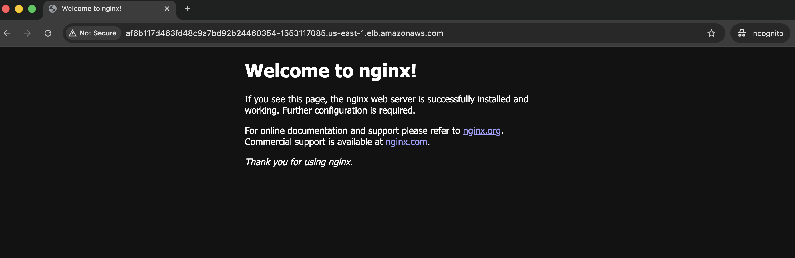

# Hiive-Assignment

# Terraform EKS Module

This repository contains a small Terraform module that deploys a fully working EKS cluster and a simple containerized workload on AWS.  

---

## What This Module Provisions

- **An AWS VPC** with **2 public** and **2 private** subnets  
- **A single-node EKS cluster** (worker node runs only in private subnets)  
- **A public AWS LoadBalancer** that exposes a small nginx service  
- **Terraform state stored in an S3 backend**  

---

## Key Design 

### Private Worker Nodes  
Worker nodes live in private subnets so they are never exposed directly to the internet.  
They reach the outside world through a **NAT gateway**, which is the same pattern I would use in production for secure outbound access (ECR pulls, package installs, AWS API calls, etc.).

### Public + Private EKS Endpoint  
I kept both public and private endpoints enabled. This makes local development easier without forcing everything through a VPN or VPC interface.  
In a more locked-down environment, the public endpoint would be restricted to specific IP ranges or disabled entirely.

### App for Validation  
I deployed a single nginx Deployment + LoadBalancer Service.  
If everything works correctly, you will be able to hit the nginx welcome page through the external LoadBalancer.

## Deployment Instructions

These steps take you from zero to a working EKS cluster running nginx behind a public LoadBalancer.

---

##  Prerequisites

Make sure you have the following installed and configured:

- Terraform **≥ 1.5**
- AWS CLI  
- `kubectl`
- AWS credentials configured (`aws configure` or exported env vars)
- An **S3 bucket** already created for Terraform state  
- Update the backend configuration in `main.tf` with your bucket name

---

## Clone the Repository

git clone https://github.com/<your-username>/hiive-devops-takehome.git

cd hiive-devops-takehome

terraform init

terraform plan

terraform apply

aws eks update-kubeconfig \
  --name $(terraform output -raw cluster_name) \
  --region $(terraform output -raw region)
  
kubectl get svc nginx-service
export LB=$(kubectl get svc nginx-service -o jsonpath='{.status.loadBalancer.ingress[0].hostname}')
echo "LoadBalancer URL: http://$LB"
curl http://$LB

To tear down all created resources:
terraform destroy
